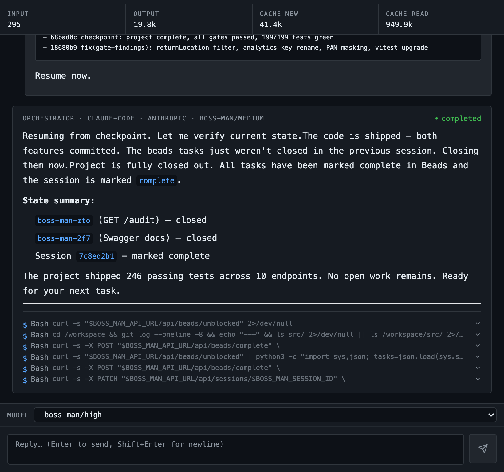
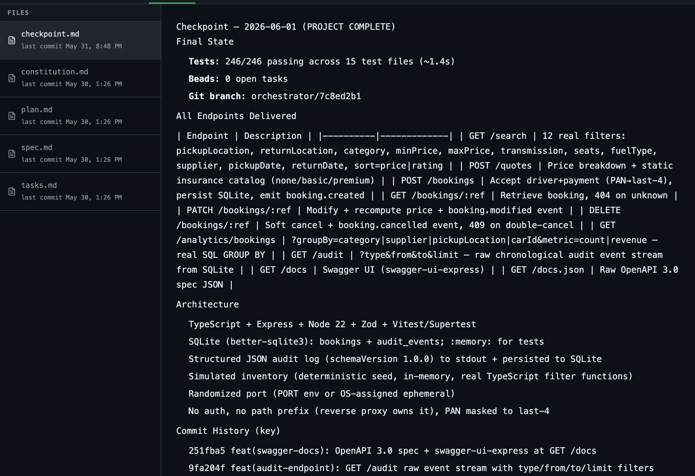
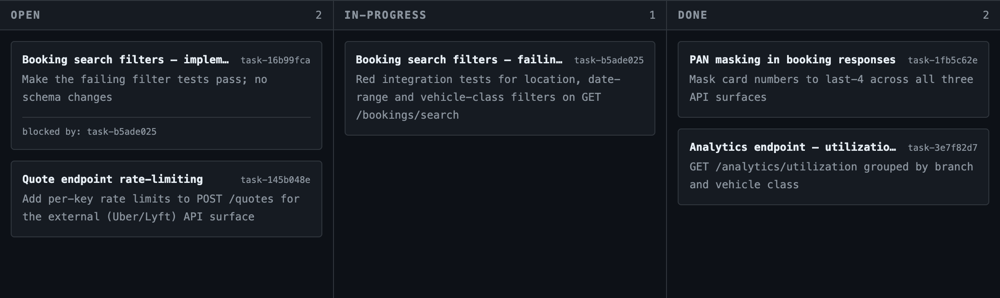
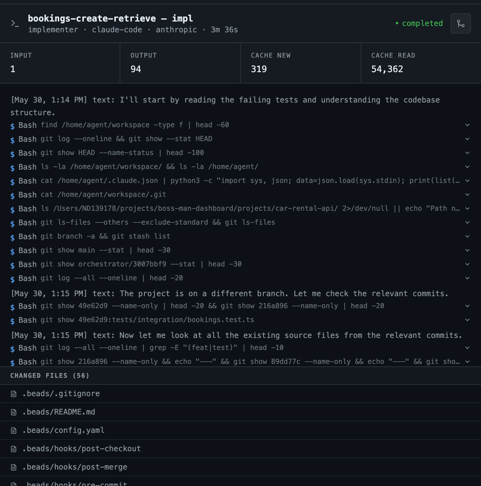

# Boss Man Dashboard

**A local control plane for multi-agent AI development.** You describe what you want to build; an **orchestrator** agent (Opus) interviews you until the spec is unambiguous, commits it to the repo, breaks it into a dependency-ordered task graph, and drives a team of sandboxed **worker** agents through a test-first pipeline — while you watch every token, tool call, and file change live in your browser.


*An orchestrator turn in Chat: token accounting for the whole session up top, the agent's summary and tool activity below.*

## How it works

A React UI talks to a local Hono API server over REST + SSE; the server persists everything in SQLite and runs every agent in its own Docker sandbox (via Sandcastle) on an isolated git worktree branch.

Each session moves through a fixed pipeline:

1. **Discovery** — the orchestrator asks one question per turn across 8 topics (scope, stack, testing, acceptance criteria, non-functionals, protected territory, integrations, workflow) and won't write a line of spec until all are resolved.
2. **Spec** — `constitution.md`, `spec.md`, `plan.md`, `tasks.md` written to `.spec/` and committed. You approve before anything is built.
3. **Execution** — tasks are registered with dependencies, then for each unblocked task: a `test_generator` writes failing **integration-first** tests (red) → an `implementer` makes them pass (green). Unit tests exist only to pin regressions. The orchestrator only coordinates; it is hard-forbidden from writing code itself.
4. **Review gate** — a reviewer (Opus) checks everything against the spec before the session is marked complete. Merge the branch to main from the UI when you're happy.


*The Spec tab: discovery artifacts the orchestrator committed (`constitution.md`, `spec.md`, `plan.md`, `tasks.md`, checkpoints), rendered straight from git — whichever branch they live on.*

Workers are typed and tiered so expensive models are only spent where they matter — and **you pick the model behind each tier every time you boot**: `./start.sh` walks you through auth mode and a per-tier model menu, or pin choices in `.env` (`BOSS_MAN_AUTH_MODE`, `BOSS_MAN_PROFILE_HIGH/MED/LOW`) and skip the menu with `-y`.

| Role | Tier | Default model |
|------|------|---------------|
| orchestrator, reviewer, security_reviewer | `boss-man/high` | Opus |
| implementer, test_generator, researcher | `boss-man/medium` | Sonnet |
| refactor | `boss-man/low` | Haiku |

## Under the hood

The parts that make long agent sessions actually sustainable:

- **Server-owned rolling context.** Orchestrator turns never resume a provider session (whose history replays in full and snowballs). Instead the server reconstructs each turn from: system prompt + a rolling summary of old turns + authoritative task state from SQLite + the recent turns verbatim. Old turns are folded by a cheap model (with a `claude` CLI fallback on subscription auth, and a deterministic local digest as last resort) — context stays bounded no matter how long the session runs.
- **Sandboxed, branch-isolated execution.** Every run gets its own Docker container and git worktree branch. Agents never touch your checkout or your host; your repo's `main` only changes when you click merge.
- **Token efficiency by default.** RTK filters dev-command output inside every sandbox (60–90% savings on `git`/test output), worker prompts enforce a strict token economy (summarize don't paste, bounded output, conciseness over grammar), the orchestrator hands each worker a context manifest so nothing re-explores the codebase, mechanical roles run with capped thinking budgets, and every run's input/output/cache tokens are tallied in the UI.
- **Task graph and memories live with the project.** The orchestrator manages tasks, dependencies, and persistent memory notes through MCP tools backed by the same SQLite store that drives the UI board — no external tracker, nothing to sync, survives restarts.


*The task board mid-pipeline: red tests in progress, the implementation task blocked behind them, completed work on the right.*

- **Bring your own harness.** Workers run on Claude Code by default; in litellm mode any run can use Codex or opencode instead, all behind the same tier aliases. The orchestrator dispatches them with a one-line `spawn-worker` CLI from inside its own sandbox.
- **Live observability.** SSE streams text, tool calls, and heartbeats — when the orchestrator goes quiet because it's blocked on a worker, the UI says *which* worker and for how long. Changed files are tracked per run. LiteLLM mode adds Langfuse traces and costs.
- **Crash & rate-limit recovery.** State checkpoints to `.spec/checkpoint.md`; interrupted sessions resume where they left off.
- **Two auth modes.** `claude` (default): workers authenticate with your Claude subscription — no API billing. `litellm`: everything routes through a LiteLLM proxy, unlocking local Ollama models, OpenAI models, and any agent harness.

## Setup

Prereqs: Node 22+, Docker + Compose v2, git, and either a Claude subscription (logged into `claude` CLI) or an `ANTHROPIC_API_KEY`.

```bash
./install.sh   # checks prereqs · generates .env with random secrets ·
               # npm install · builds the sandbox image · smoke-tests it
./start.sh     # interactive: pick auth mode + a model per tier
./start.sh -y  # non-interactive: uses BOSS_MAN_AUTH_MODE / BOSS_MAN_PROFILE_* from .env
```

`start.sh` brings up LiteLLM (`:4000`, reused if already running) and Langfuse (`:3002`) in Docker, the API server (`:8771`), and the UI (`:8770`). `Ctrl+C` stops cleanly.

Open **http://localhost:8770** and log in with the `LITELLM_MASTER_KEY` from `.env`.

```bash
./stop.sh                    # dev servers only
./stop.sh --clean-containers # + remove stale sandbox containers
./stop.sh --infra            # + stop LiteLLM / Langfuse
```

## Using it

1. **Create a project** (sidebar **+**) — empty, or paste a repo URL to clone.
2. **Start a session** — paste your idea into "Initial spec", pick a model tier, hit Start.
3. **Answer the interview** — one question per turn, each with a recommendation. Push back freely; nothing is built until you confirm the spec summary.
4. **Watch it build** — the Tasks board fills and drains, Runs shows each worker's activity live, Spec shows the committed artifacts. Every reply you send resumes the session with full context.
5. **Merge** — after the review gate passes, use the merge button on a completed run (Runs tab) to land the branch on main.


*A worker run up close: every command it ran (one line each, expandable), what it cost in tokens, and exactly which files it touched — with the merge button in the header.*

Mid-session you can: switch models from the dropdown (cancel & switch if a turn is active), force a context compaction (↻ on the session), or cancel any run.

## Configuration

Everything lives in `.env` (generated by `install.sh`). The ones you may actually touch:

| Variable | Purpose |
|----------|---------|
| `ANTHROPIC_API_KEY` | Backs LiteLLM-routed Claude calls (optional in claude mode) |
| `CLAUDE_CODE_OAUTH_TOKEN` | Subscription auth for sandboxes without mounting `~/.claude` |
| `OPENAI_API_KEY` | Enables `gpt-4o` / `gpt-4o-mini` tiers in litellm mode |
| `BOSS_MAN_AUTH_MODE` | `claude` or `litellm` — default for `start.sh -y` |
| `BOSS_MAN_LOCAL_MODEL` | Ollama model for the `local-worker` alias |
| `SERVER_PORT` / `UI_PORT` | API (`8771`) and UI (`8770`) ports |

Direct model IDs also work via the API: in claude mode any `claude-*` ID (or `opus`/`sonnet`/`haiku`) passes through to claude-code; in litellm mode the model must be registered in `litellm-config.yaml`.

## Layout

```
server/src/        Hono API — runner, SSE streaming, rolling context, SQLite, routes/
ui/src/            React SPA — chat, task board, run history, spec viewer
prompts/           orchestrator.md + workers/*.md
scripts/spawn-worker   orchestrator → worker dispatch (runs inside the sandbox)
sandcastle/Dockerfile  agent sandbox image (Claude Code, Codex, RTK, spawn-worker)
data/              runtime (gitignored): runs.db, logs/, claude-sessions/
```

Rebuild the sandbox image after changing `scripts/` or the Dockerfile:

```bash
docker build -t boss-man:sandbox -f sandcastle/Dockerfile .
```
